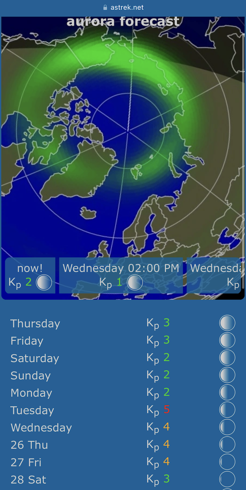

# aurora forecast
Northern lights and moon phase web application

## description
* simple, light and fast
* hosted on [OpenBSD](https://www.openbsd.org)
* updating data from [NOAA](http://www.noaa.gov/) 
* phase of the moon by [pom(6)](https://man.openbsd.org/pom.6)
* picture edited with [ImageMagick](https://imagemagick.org)
